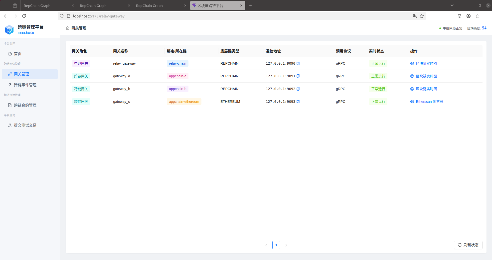
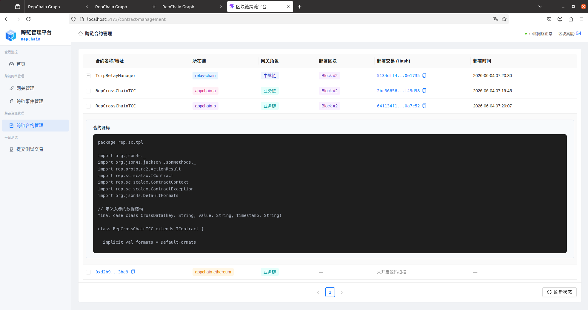
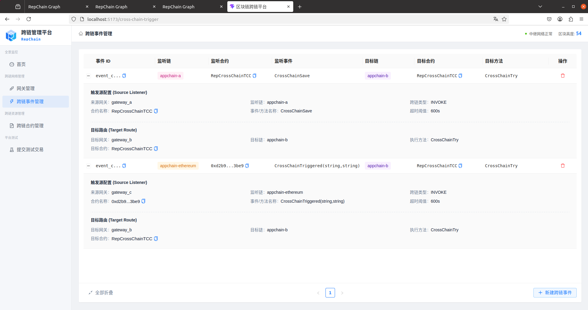
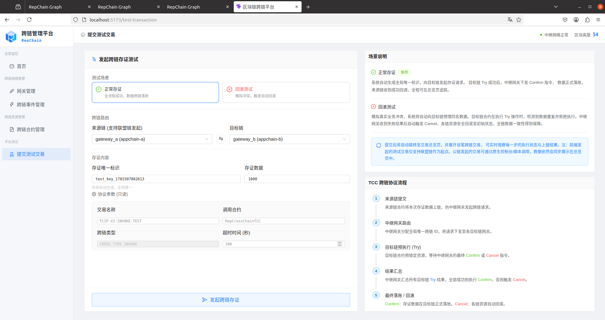

# RepChain跨链平台部署与用户手册

[TOC]

## 1. 系统部署指南

本章节介绍系统各组件的网络拓扑配置、敏感信息注入及标准化启动流程。

### 1.1 前置运行环境

#### 1.1.1 基础环境与存储

- **基础环境**：JDK 11 或更高版本。
- **架构约束**：中继跨链架构中，**目前中继链仅支持部署在 RepChain 上**，以太坊等公链/其他联盟链仅可作为业务链接入。
- **存储与权限**：程序启动用户的执行目录必须具备读写权限。系统会在运行时自动生成以下 LevelDB 持久化目录，**目录删除以后将失去网关数据**：
  - `./data/db` （中继网关状态数据）
  - `./data/gateway_db` （RepChain 网关状态数据）
  - `./data/eth-gateway-db` （以太坊网关状态数据）

#### 1.1.2 网络与端口连通性总表

> **配置指引**：以下清单基于系统标准的本地集群示例。实际部署时，请**务必以各组件 `config/application.yml` 中的配置为准**，并确保防火墙策略放行了相应的端口。

**网络拓扑与端口映射表**

| **组件名称**                    | **对外暴露端口 **                                 | **需要访问的目标**                                           | **连通性说明**                                               |
| ------------------------------- | ------------------------------------------------- | ------------------------------------------------------------ | ------------------------------------------------------------ |
| **中继网关** `tcip-rep-relayer` | **`8000`** (REST) **`9090`** (gRPC 枢纽)          | **`127.0.0.1:19081`** (中继链底层节点)                       | **核心节点**：必须放行 `9090` 端口，以便所有的业务网关都能连入。同时它自身必须能访问 `19081` 节点来同步中继链区块。 |
| **业务网关 A/B** *(RepChain)*   | **`8001 / 8002`** (REST) **`9091 / 9092`** (gRPC) | **`20081 / 21081`** (对应底链节点) **`9090`** (中继网关)     | **联盟链节点**：监听 `909x` 是为了接收中继网关下发的 Confirm/Cancel 回调指令；同时它必须能连通自己的底链节点和中继网关。 |
| **业务网关 C** *(以太坊)*       | **`8003`** (REST) **`9093`** (gRPC)               | **`Alchemy/Infura 公网节点`** (HTTPS 与 WSS) **`9090`** (中继网关) | **公链节点**：监听 `9093` 供中继回调。由于对接的是公网测试网，服务器必须具备访问外网的能力，且必须同时支持 HTTP 与 WebSocket 通道。 |
| **管理平台** `Portal-BFF`       | **`9000`** (后端 API)                             | **`8000 - 8003`** (各网关的 REST 端口)                       | **前端接口**：负责为 Web 界面提供数据，它不需要连 gRPC，但必须能连通上述所有网关的 800x 端口。 |

### 1.2 标准部署目录结构参考

为了确保系统能正确读取外部配置文件及证书，建议按照以下目录规范进行组织。各个网关应当运行在独立的目录（或独立的容器）中。

以下为一个标准的本地测试集群（1个中继网关 + 2个联盟链网关 + 1个公链网关）的物理目录拓扑：

```
gateway-deploy/
├── secrets.env                     # 全局环境变量文件（存放私钥与密码，启动前 source 注入）
├── relayer/                        # 中继网关目录
│   ├── config/                     # 外部配置文件夹
│   │   ├── application.yml         # 覆盖内部默认配置的生产参数
│   │   └── certs/
│   │       └── relayer_private.pem # 中继网关签名私钥
│   ├── data/db/                    # 运行时自动生成的 LevelDB 目录（不可删）
│   ├── logs/                       # 运行时自动生成的日志目录
│   └── tcip-rep-relayer-*.jar      # 核心运行程序
├── gateway-a/                      # 业务网关 A (RepChain)
│   ├── config/
│   │   ├── application.yml
│   │   ├── init-events.json        # 自动装载的跨链事件触发规则
│   │   └── certs/
│   │       └── gateway_private.pem # 网关 A 签名私钥
│   ├── data/gateway_db/
│   └── tcip-rep-repchain-*.jar
└── gateway-c/                      # 业务网关 C (以太坊)
    ├── config/
    │   ├── application.yml
    │   └── init-chain-configs.json # 自动装载的以太坊合约 ABI 与地址配置
    ├── data/eth-gateway-db/
    └── tcip-rep-ethereum-*.jar
```

> **相对路径说明**：YAML 配置文件中的路径（如 `path: "./data/gateway_db"` 或 `pem-file: "config/certs/gateway_private.pem"`）均是以 `.jar` 文件所在目录为当前工作目录计算的。

### 1.3 核心配置规范

系统设计遵循外部配置优先原则。各 JAR 包同级目录下存在 `config/` 目录，并放置 `application.yml` 进行参数覆盖。

#### 1.3.1 敏感信息隔离

所有涉及资产权限的私钥与密码不建议以明文写入配置文件，而是通过操作系统环境变量注入。在`config/application.yml`中使用 Spring Boot 占位符语法引用环境变量：

```
# 示例：RepChain 网关私钥密码
repchain:
  private-key:
    password: ${GATEWAY_KEY_PASSWORD}

# 示例：以太坊网关私钥和API Key
ethereum:
  rpc-url: ${GATEWAY_ETH_RPC_URL}
  ws-url: ${GATEWAY_ETH_WS_URL}
  credentials:
    private-key: ${GATEWAY_ETH_PRIVATE_KEY}
```

可以采用两种方式注入使用，其中，不同实例需要使用独立的环境变量名称：

- 优先选择 `secrets.env` 方式。在部署目录下维护统一的 `secrets.env` 文件集中定义环境变量，在启动网关前执行`source secrets.env`

```
# secrets.env
RELAYER_KEY_PASSWORD=your_password
GATEWAY_A_KEY_PASSWORD=your_password
GATEWAY_B_KEY_PASSWORD=your_password
GATEWAY_C_ETH_PRIVATE_KEY=your_private_key
ETH_RPC_URL=https://eth-mainnet.rpc.provider/v2/YOUR_API_KEY
ETH_WS_URL=wss://eth-mainnet.ws.provider/v2/YOUR_API_KEY
```

- 在控制台或脚本里逐条 `export`，例如`export GATEWAY_A_KEY_PASSWORD=your_password`

#### 1.3.2 中继网关核心配置

需要确认底层节点连通性与自身中继服务的暴露地址。

```
repchain:
  # 指向中继链底层节点的 REST API 地址
  host: "127.0.0.1:19081"
  identity:
    # 填写中继网关在中继链上合法注册的身份凭证
    credit-code: "identity-net:121000005l35120456"
    cert-name: "node1"

gateway:
  # 本中继网关对外暴露的 gRPC 枢纽地址，业务网关将连接此地址
  address: "127.0.0.1:9090"
```

#### 1.3.3 业务跨链网关配置

业务网关配置的重点在于确立全局唯一性身份，并正确指向中继网关。以下以以太坊网关为例（RepChain 网关同理）：

```
ethereum:
  # 指向该网关所挂载的业务链底层节点地址（仅以太坊网关包含）
  rpc-url: "https://eth-sepolia.g.alchemy.com/v2/..."
  ws-url: "wss://eth-sepolia.g.alchemy.com/v2/..."

gateway:
  # 该网关在中继体系中的全局唯一ID，不可与其他网关重复，必须与中继端注册信息绝对一致
  gateway-id: "2"
  # 所代表的网络资源标识
  chain-rid: "appchain-ethereum"
  
  relay:
    # 必须指向 1.2.2 中继网关的 gRPC 地址
    address: "127.0.0.1:9090"
```

#### 1.3.4 管理平台核心配置

管理平台需要通过配置连接底层网关。请修改 `tcip-rep-portal-bff/config/application.yml`：

```
bff:
  # 必须设置为 real 才能连接真实网关（mock 为前端调试模式）
  mode: real

  relayer:
    # 必须指向中继网关的 REST API 与 gRPC 枢纽地址
    url: "http://localhost:8000"
    name: "relay_gateway"
    grpc-address: "127.0.0.1:9090"
    # 必须指向中继链底层的实时区块可视化地址（用于前端跳转）
    explorer-url: "http://127.0.0.1:19081"
    
  gateways:
    # 数组列表：需在此处穷举所有已接入的业务网关
    - id: "0"                           # 必须与网关自身的 gateway-id 一致
      name: "gateway_a"
      url: "http://localhost:8001"      # 必须指向该网关的 REST API 端口
      chain-rid: "appchain-a"
      grpc-address: "127.0.0.1:9091"
      tx-verify-type: "rpc"
      chain-type: "CHAIN_TYPE_REPCHAIN" # 区分RepChain与以太坊
      explorer-url: "http://127.0.0.1:20081" # RepChain底层地址
      
    - id: "2"
      name: "gateway_c"
      url: "http://localhost:8003"
      chain-rid: "appchain-ethereum"
      grpc-address: "127.0.0.1:9093"
      tx-verify-type: "spv"             # 根据以太坊网关的实际验证模式填写
      chain-type: "CHAIN_TYPE_ETHEREUM" # 区分RepChain与以太坊
      explorer-url: "https://sepolia.etherscan.io" # 以太坊浏览器路径
      # 以太坊特有配置：由于公链无法通过统一接口动态扫描部署时间，需手动补齐用于前端展示
      static-contracts:
        # 注意：此处必须填写 0x 开头的真实合约地址
        - contract-name: "0x在此替换为您实际部署的以太坊代理合约地址"
          tx-id: "0x在此替换为部署该合约时的交易Hash"
          block-height: 1234567       # 替换为实际部署所在的区块高度
          deploy-time: "YYYY-MM-DD HH:mm:ss" # 替换为实际部署时间
```

### 1.4 标准启动顺序

跨链平台在启动时具有严格的依赖时序，您可以参考项目提供的自动化脚本，或按以下顺序列操作：

1. **启动底层节点网络**：启动 RepChain 节点，等待网络共识建立完毕（联盟链通常需等待数十秒以完成创世块落盘）。

2. **部署智能合约**：通过 RCJava 或 Hardhat 工具链，将中继主合约与业务跨链合约部署至对应的底层网络中。

3. **启动网关集群**：依次启动中继网关（Relayer）与各业务跨链网关。若有统一部署目录，也可通过执行自动化脚本拉起整个集群。

4. **验证 gRPC 通道**：向任意业务网关发送探活请求：

   ```
   curl http://localhost:8003/v1/cross-chain/ping
   ```

   *若返回包含当前时间戳的 JSON 响应，则证明底层 gRPC 通道握手成功。*

5. **启动管理平台并访问**：分别启动 Portal 平台的后端 BFF 服务与前端 Web 项目（如通过 `pnpm dev`）。完成后，在浏览器中打开前端本地地址（默认通常为 `http://localhost:5173`），即可进入可视化控制台。

### 1.5 源码获取与自行编译（可选）

若您的实施环境是从开源仓库代码开始构建全套系统，而非使用预编译发布包，请按照本节的多仓库结构进行全局编译。编译完成并成功部署合约以后，再根据配置文件中的端口设置进行连通性测试。

**前置环境：**

- **后端构建**：Maven 3.6+
- **前端构建**：Node.js 18+ 与 pnpm
- **版本控制**：Git

#### 1.5.1 拉取与编译核心网关组件 (tcip-rep)

核心网关项目通过 Git Submodule 聚合了 `ethereum`、`relayer`、`repchain`、`common` 和 `proto` 五个子模块。

```
# 1. 克隆主仓库并初始化所有子模块
git clone --recurse-submodules https://gitee.com/tcip-rep/tcip-rep.git
cd tcip-rep

# 2. 触发全局构建（跳过测试与 Scala 原生代码重生成）
mvn clean package -Dscalapbc.skip=true -DskipTests
```

构建完成后，各网关的可执行 `.jar` 包将生成在对应子模块的 `target/` 目录下。

#### 1.5.2 拉取与编译管理平台 (tcip-rep-portal)

管理平台独立于网关组件，采用前后端分离架构，需要分别编译 BFF 层与 Web 层。

```
# 1. 克隆管理平台仓库
git clone https://gitee.com/tcip-rep/tcip-rep-portal.git
cd tcip-rep-portal

# 2. 构建后端 BFF 服务 (Spring Boot)
cd tcip-rep-portal-bff
mvn clean package -DskipTests
# 产物位置: target/tcip-rep-portal-bff-*.jar

# 3. 构建前端 Web 服务 (React)
cd ../tcip-rep-portal-web
pnpm install
pnpm build
# 产物位置: dist/ 目录 (生成静态文件，可交由 Nginx 托管)
```

> **运行提示**：`tcip-rep-portal-bff` 编译出的 jar 包需要单独运行（`java -jar`），其配置依赖 `application.yml` 中的 `bff.gateways` 映射。前端静态文件 `dist/` 需配置 Web 服务器代理至 BFF 的 9000 端口。

#### 1.5.3 智能合约 (tcip-rep-contracts)

可用的合约工程独立存放于 `tcip-rep-contracts` 仓库中，您需要自行将合约部署到目标链，并完成对应配置。

**1. RepChain 合约部署** 

可以使用 [RCJava](https://www.google.com/search?q=https://gitee.com/BBDC/rcjava) SDK 进行部署。由于 RepChain 的 DID 权限机制，操作须包含三步：部署合约、注册方法、授权网关身份。

- **配置说明**：部署完成后，网关会自动从 `config/init-events.json`（事件触发规则）中读取合约名称进行路由，**无需**在网关做额外的全局地址配置。

**2. 以太坊合约部署** 

可以使用 Hardhat 等工具链部署 `EthCrossChainTCC` 代理合约（UUPS 模式）。

- **部署约束**：由于`EthCrossChainTCC` 代理合约代码层面实现了权限校验，在初始化代理合约时，必须将网关的账户地址（需与 `application.yml` 中配置的私钥对应）作为参数传入，以赋予网关回调写权限。
- **配置说明**：部署成功后，需要将生成的**代理合约地址**（0x...）填入以太坊网关的 `config/init-chain-configs.json` 文件中。

## 2. 跨链管理平台操作手册

本章节介绍通过 Web 控制台完成跨链的相关配置，执行跨链业务。

### 2.1 构建跨链通道

完整的跨链业务通道建立包括以下四个标准化步骤：

1. **网关与链资源检查**：进入 **[网关管理]**，确认中继网关与业务链网关均处于 `正常运行` 状态，名称、绑定/所在链等信息加载正确。

   > **提示**：若网关未显示或持续显示离线，请首先检查 Portal-BFF 后端文件 `application.yml` 中的 `bff.gateways` 列表是否正确映射了底层网关的 REST 端口与 ID。

2. **智能合约确认**：进入 **[跨链合约管理]**，查看 RepChain 上的跨链业务合约RepCrossChainTCC是否已正确显示，且点击可以实时获取合约代码。

   > **提示**：联盟链 (RepChain) 的智能合约信息是根据跨链事件规则中填写的合约名称动态获取的，新建正确的事件规则后平台会自动拉取。若未能正确显示，说明网关连接异常或合约名称填写错误。而公链合约受限于网络特性，是通过管理平台后端 `application.yml` 中的 `static-contracts` 静态装载展示的，请确保该配置项的合约地址填写正确。

3. **建立事件规则**：进入 **[跨链事件管理]**，新建跨链事件规则。选择源网关与目标网关，配置需监听的合约、方法名以及目标链的目标合约和执行方法等信息。

4. **提交测试交易**：进入 **[提交测试交易]** 填写存证数据，平台将自动跳转到 **[首页]** 面板，可查看新交易的状态流转轨迹。

### 2.2 页面操作指引

#### 2.2.1 网关管理

提供跨链底层网络基础设施的全局状态监控与拓扑可视化。



- 统一展示当前系统所接入的中继网关与所有业务跨链网关。正常情况下，各网关卡片应显示绿色的 `正常运行` 状态指示。
- 若网关状态显示为 `离线` 或持续处于加载状态，代表平台与底层网关失联。此时应优先核对 BFF 后端的 `application.yml` 配置文件（即 `bff.gateways` 列表中的端口映射是否正确），并确认服务器防火墙已放行相关端口。

#### 2.2.1 跨链合约管理

提供多链架构下的智能合约可视化管理。



- **RepChain**：直接点击列表行展开，即可查看完整的合约源码。
- **以太坊**：受限于 EVM 源码验证机制，控制台不直接拉取源码。展开行会提供引导提示，点击按钮可跳转至 Etherscan 浏览器的 Contract 标签页查看实时 ABI 与源码。

#### 2.2.2 跨链事件管理

定义底链数据交换路由的核心模块。



- **标准 TCC 跨链模板**：默认开启。选择源与目标网关后，系统会基于 `CHAIN_TYPE` 自动装填底层协议所需的全部握手参数（包含固定合约名、事件签名及回调映射），参数和默认合约的代码逻辑一致。

#### 2.2.3 提交测试交易

提供跨链状态机的闭环验证工具。



- **验证场景**：
  - **正常存证 (HAPPY)**：验证正常情况下的 `Try -> Confirm` 正向落账流程。
  - **回滚测试 (CANCEL)**：系统提前在目标链存储当前填写的存证数据，导致跨链过程中在检查目标链数据时产生键冲突，从而触发目标链预执行失败。用于验证中继网关是否能准确捕获异常并向所有节点下发 `Cancel` 补偿指令，保证最终一致性。
- **发起端限制**：当前控制台的自动签名机制仅支持 **RepChain** 作为跨链测试的源链。若需测试 以太坊 -> RepChain 的链路，请通过 Hardhat 等工具链对部署在以太坊上的 `CrossChainSave` 方法进行调用，事务状态将自动同步至 Dashboard。
- 为满足目标链 Scala 端的反序列化需求，调用以太坊合约时传入的 `payload` 参数**必须是序列化后的特定 JSON 数组字符串**。结构必须包含 `key`、`value` 和 `timestamp`。示例： `'[{"key":"eth2rep_001", "value":"跨链数据内容", "timestamp":"2026-06-11T12:00:00.000Z"}]'` 若传入普通字符串，网关解析将报错并导致跨链事务失败。具体参数以部署的合约代码为准。

#### 2.2.4 首页

提供全局跨链大盘数据与 TCC 状态机的可视化追踪，是日常运行监控与异常排障的核心面板。


- **状态流转**：直观展示一笔跨链业务从发起、执行到最终落账的完整生命周期。
- **交易追踪**：点击展开任意单条跨链记录，可查看该跨链事务在各个阶段在源链、目标链和中继链上产生的相关真实底层交易哈希。可点击哈希前往对应链的区块浏览器进行查看。

## 跨链操作视频

<video width="100%" controls>
  <source src="assets/caozuo.mp4" type="video/mp4">
  您的浏览器不支持 video 标签。
</video>